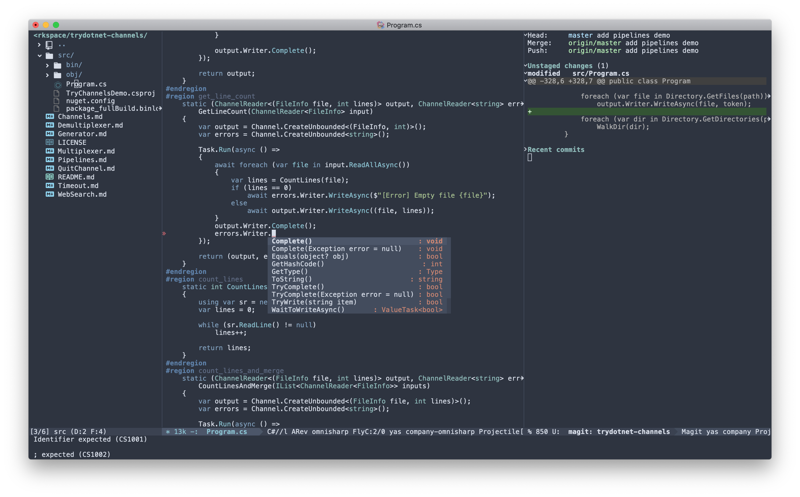

# .emacs.d


My personal Emacs configuration tailored for C#, TypeScript and Go development. The language-specific settings are kept in separate files whereas the common settings can be found in `global-settings.el` and the used packages in `packages.el`

## Installation

Back up your `~/.emacs.d/` if you have one:

```sh
mv ~/.emacs.d/ ~/.emacs.d.backup/
```

Clone:

```sh
git clone https://github.com/deniskyashif/.emacs.d.git ~/.emacs.d
```


Theme: Nord